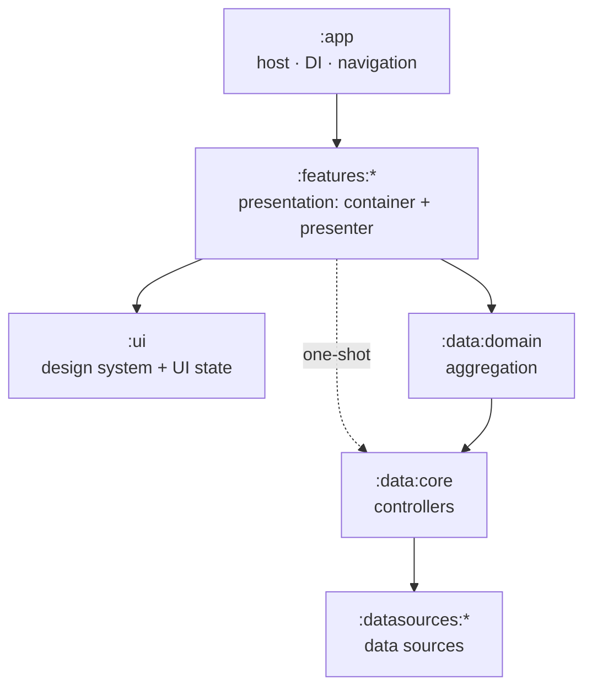

# Rick & Morty — Modular Architecture

A modular Android app where dependencies flow **one way**, from the screen down to
the network. Each module's README is a slide; read them in order to follow a tap
as it travels to the network and a result as it travels back.

## The flow

## The model in one breath

- **Data** has two parts — a **controller** and a **data source**. A controller is
  a **repository**, a **WorkManager worker**, or a **PagingSource**.
- **Domain** does one thing: **aggregation**.
- **Presentation** has two parts — a **container** (the ViewModel) and a
  **presenter** (the Composable).

## The slides

| Module | Slide | Role |
|---|---|---|
| `:app` | [app](app/README.md) | Host — Koin init + Navigation 3 |
| `:features:characters` | [feature](features/characters/README.md) | Presentation: container + presenter |
| `:ui` | [ui](ui/README.md) | Design system + shared UI state |
| `:data:domain` | [domain](data/domain/README.md) | Aggregation (use cases) |
| `:data:core` | [data](data/core/README.md) | Controllers |
| `:datasources:remote` | [datasource](datasources/remote/README.md) | Remote data source |

## The one rule

Every dependency points **inward**. A layer talks to the **public contract** of the
one beneath it and never sees an `internal` impl. That's what lets each piece be
swapped, faked, and tested on its own.
