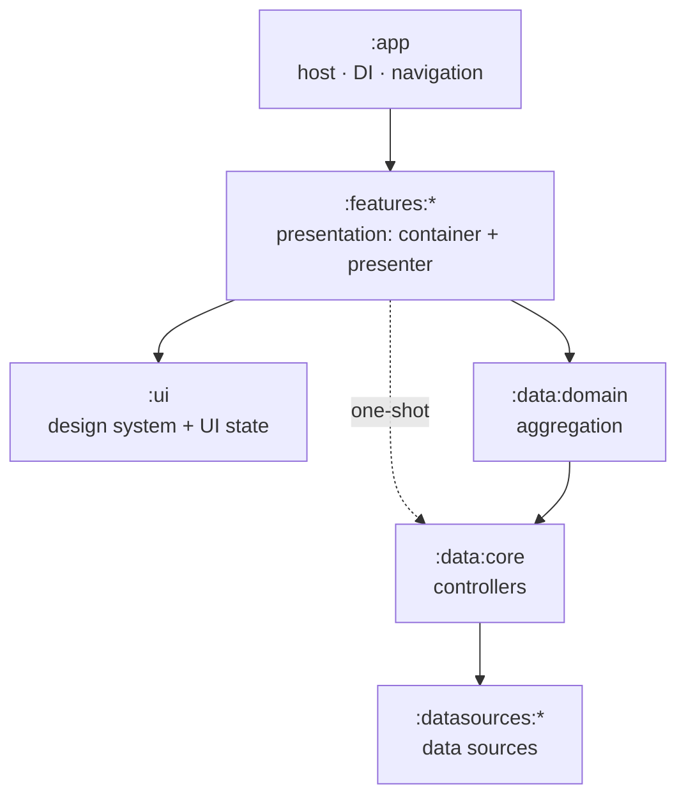

# Rick & Morty — Modular Architecture

A modular Android app where dependencies flow **one way**, from the screen down to
the network. Each module's README is a slide; read them in order to follow a tap
as it travels to the network and a result as it travels back.

The network is the [Rick and Morty API](https://rickandmortyapi.com/documentation).

## The flow



## The model in one breath

- **Data** has two parts — a **controller** and a **data source**. A controller is
  a **repository**, a **WorkManager worker**, or a **PagingSource**.
- **Domain** does one thing: **aggregation**.
- **Presentation** has two parts — a **container** (the ViewModel) and a
  **presenter** (the Composable).

## How it looks

Two screens.

```text
   Character list                    Character details
 ┌───────────────────┐             ┌───────────────────┐
 │ Characters    [Q]  │            │ ‹ Rick Sanchez    │
 ├───────────────────┤             ├───────────────────┤
 │ (◐) Rick Sanchez  │             │        (◐)        │
 │     • Alive·Human │             │    Rick Sanchez   │
 │     Citadel…      │             │     [ • Alive ]   │
 │ (◐) Morty Smith   │             │ Species    Human  │
 │     • Alive·Human │             │ Gender     Male   │
 │     Earth…        │             │ Origin     Earth  │
 │ (◐) Birdperson    │             │ Location   Cita…  │
 │     • Dead·Bird   │             │ Episodes   51     │
 └───────────────────┘             └───────────────────┘
   PagingData<Character>            ViewState<Character>
```

### Character list — `GET /character` (paginated)

A scrollable, **infinitely paged** list — `info.next` drives the next page. Each row
is a card built from the fields of one `results[]` entry:

| Shows | From | Notes |
|---|---|---|
| portrait | `image` | a Coil `AsyncImage`, circular |
| name | `name` | |
| status | `status` | a colored dot — green `Alive` · red `Dead` · gray `unknown` |
| species | `species` | on the status line |
| location | `location.name` | the sub-line |

A search field filters by `?name=`. Tapping a row opens the details screen.
**State:** `Flow<PagingData<Character>>` (Paging 3).

### Character details — `GET /character/{id}` (one-shot)

A hero portrait (`image`), the `name`, a `status` badge, then an info panel:
`species` · `gender` · `origin.name` · `location.name` · episode count (`episode.size`).
It's a single read by `id`, so no use case — the screen goes straight to the
repository. **State:** `ViewState<Character>` (Loading / Success / Error).

## The API

Two calls back the two screens. Arrays are trimmed here for brevity.

`GET /character` — a paged envelope: `info` (the cursor) + `results` (20 per page).

```json
{
  "info": {
    "count": 826,
    "pages": 42,
    "next": "https://rickandmortyapi.com/api/character/?page=2",
    "prev": null
  },
  "results": [
    {
      "id": 1,
      "name": "Rick Sanchez",
      "status": "Alive",
      "species": "Human",
      "type": "",
      "gender": "Male",
      "origin": { "name": "Earth", "url": "https://rickandmortyapi.com/api/location/1" },
      "location": { "name": "Earth", "url": "https://rickandmortyapi.com/api/location/20" },
      "image": "https://rickandmortyapi.com/api/character/avatar/1.jpeg",
      "episode": ["https://rickandmortyapi.com/api/episode/1"],
      "url": "https://rickandmortyapi.com/api/character/1",
      "created": "2017-11-04T18:48:46.250Z"
    }
  ]
}
```

`GET /character/2` — a single character (the details screen):

```json
{
  "id": 2,
  "name": "Morty Smith",
  "status": "Alive",
  "species": "Human",
  "type": "",
  "gender": "Male",
  "origin": { "name": "Earth", "url": "https://rickandmortyapi.com/api/location/1" },
  "location": { "name": "Earth", "url": "https://rickandmortyapi.com/api/location/20" },
  "image": "https://rickandmortyapi.com/api/character/avatar/2.jpeg",
  "episode": [
    "https://rickandmortyapi.com/api/episode/1",
    "https://rickandmortyapi.com/api/episode/2"
  ],
  "url": "https://rickandmortyapi.com/api/character/2",
  "created": "2017-11-04T18:50:21.651Z"
}
```

The `results[]` entry and the single character share the **same** shape — one
`CharacterDto`; the list just wraps a page of them in `info` + `results`.

## The slides

| Module | Slide | Role |
|---|---|---|
| `:app` | [app](app/README.md) | Host — Koin init + Navigation 3 |
| `:features:characters` | [feature](features/characters/README.md) | Presentation: container + presenter |
| `:ui` | [ui](ui/README.md) | Design system + shared UI state |
| `:data:domain` | [domain](data/domain/README.md) | Aggregation (use cases) |
| `:data:core` | [data](data/core/README.md) | Controllers |
| `:datasources:remote` | [datasource](datasources/remote/README.md) | Remote data source |

## The one rule

Every dependency points **inward**. A layer talks to the **public contract** of the
one beneath it and never sees an `internal` impl. That's what lets each piece be
swapped, faked, and tested on its own.

## Agents & skills

This repo carries its own conventions as **skills** and two **agents** under
`.agents/`. They're the committed source of truth; a script regenerates them into
`.claude/` (which is git-ignored), so run it once after cloning:

```bash
./.agents/sync-skills.sh
```

- **Skills** — one per layer/operation (`add-remote-datasource`, `add-repository`,
  `add-screen`, `add-destination`, …, each with a matching `*-test`). Each encodes
  this project's exact convention for that piece — naming, package, visibility,
  DI, and a verify step.
- **`builder`** — an agent that *builds* by applying the skills. Hand it a slice; it
  picks the skill, follows it verbatim, writes the code, and verifies with Gradle.
- **`slavie`** — a read-only agent that *teaches* the architecture. Ask it why
  something is shaped the way it is; it answers from these skills, the READMEs, and
  the code, and never changes anything.

In a Claude Code session in this repo:

| Do this | To |
|---|---|
| `/slavie why does domain depend on data?` | ask the teaching agent |
| "use `builder` to add the characters remote data source" | delegate a build |
| `/add-repository` (any `/add-…`) | run a skill yourself |

Building the characters slice end to end follows the layers in order:
`add-remote-datasource` → `add-dto-mapper` → `add-repository` →
`add-paging-source` → `add-viewmodel` → `add-screen` → `add-destination`.
